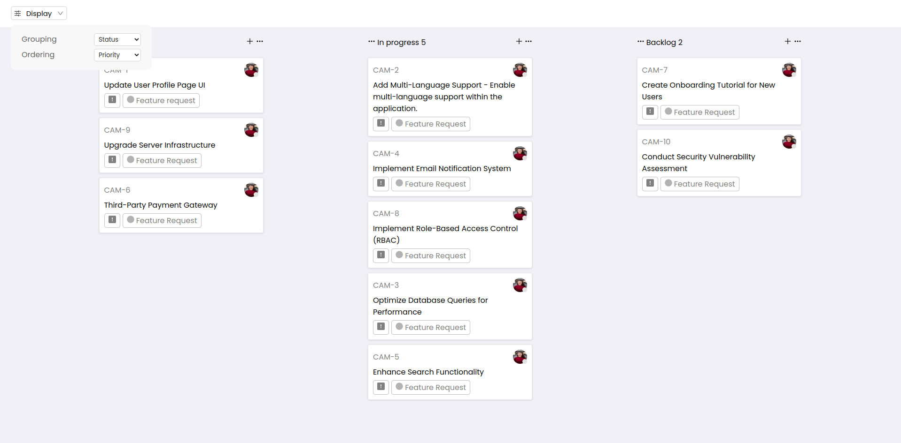
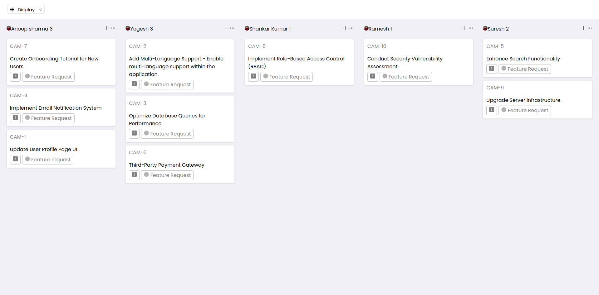
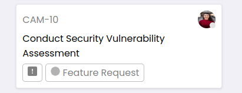

# Quicksell Kanban Board

## Introduction

This project is an interactive Kanban board application built using React JS. It interacts with the provided API from [https://api.quicksell.co/v1/internal/frontend-assignment](https://api.quicksell.co/v1/internal/frontend-assignment) to fetch and manage tickets.

## Features

- Dynamic Display: When a user clicks the "display" button and selects a grouping option, the Kanban board adjusts to reflect the user's choice.
- Grouping Options:
  1. **By Status**: Groups tickets based on their current status.
  2. **By User**: Arranges tickets according to the assigned user.
  3. **By Priority**: Groups tickets based on their priority level.
- Sorting Options:
  1. **Priority**: Arranges tickets in descending order of priority.
  2. **Title**: Sorts tickets in ascending order based on their title.

## Screenshots

### Display State:

### Grouping by User is Selected

### Grouping by Priority is Selected

### Ticket Card

## API Endpoint

- **API**: [https://api.quicksell.co/v1/internal/frontend-assignment](https://api.quicksell.co/v1/internal/frontend-assignment)

## How to Run

1. Clone the repository.
2. Install dependencies using `npm install`.
3. Start the application with `npm start`.

## Author

Anurag Deep

## Acknowledgements

Special thanks to Quicksell for providing the API and opportunity to work on this project.
